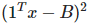

# Solving the Mean Variance Portfolio Optimisation Problem with QAOA and VQE
Calum Holker, Pavan Jayasinha, Aarsh Chaube, Tomasz Andrzejewski  
Submission for QHack open hackathon for team QLords   

Blog Post: [Using Quantum Generative Adversarial Networks for Portfolio Optimisation](https://calumholker.medium.com/using-quantum-generative-adversarial-networks-for-portfolio-analysis-f8c56ac68fd2)

## Portfolio Analysis Overview
In 1952, Markovitz proposed a novel theory that exploits diversification to engineer a portfolio with higher returns for lower risk, going against conventional beliefs that risk has a positive linear relationship to reward. Mean variance portfolio optimization is an analysis technique that was born from Markovitz's work. What Markovitz added to the game was the consideration of variance and covariance between individual stocks. The idea is to maximize return by combining assets that are anti-correlated, thus resulting in a lower volatility for the portfolio.   
This is not to say that we want our assets to be in direct opposition with each other (in that case we would never see any gains). We want our assets to be anti-correlated enough such that it cancels out the noise due to volatility in the short term while being positively correlated in the long term such that they both go up. The plot below shows the relationship between risk and returns. The efficient frontier is the optimized portfolio which occupies the "efficient" parts of the risk–return spectrum. This is the portfolio which satisfies the condition that no other portfolio exists with a higher expected return but with the same standard deviation of return.   

   

## Mathematical Description
The mean-variance portfolio optimization problem is a NP-Hard COP, making it computationally expensive for current classical computers to solve. Mathematically, we can represent this quadratic problem for n assets as:   

   

where the following notation is used:   
   

For our implementation, we simplified the conditions such that all of the budget must be spent and normalized all equity values to 1.   
Our equality constraint  states that the number of ones in our binary decision variable vector must be equal to the budget (we spend everything). We create a penalty term based upon this constraint  which is scaled by a parameter and subtracted from the objective function.

## QAOA and VQE Implementations

The problem described in the previous section can be mapped into a Hamiltonian whose ground state corresponds to the optimal solution for the mean-variance portfolio problem. An implemetation of the Variational Quantum Eigensolver (VQE) and the Quantum Approximate Optimization Algorithm (QAOA) can then be used to find the optimal solution for a given set of equities. Due to time constraints we took some pre defined functions from Qiskit Aqua and used them to implement the solution in PennyLane. In our implementation we have also further backtested each approach against three random stock portfoliios from the S&P 500. The results of this are shown below (showing the growth of the portfolios over time).   
   
   
   
