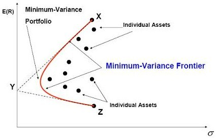

## What is the mean variance portfolio optimization problem?
In 1952, Markovitz proposed a novel portfolio theory that exploits diversification to engineer a portfolio with higher returns for lower risk, going against conventional beliefs that risk has a positive linear relationship to reward. Mean variance portfolio optimization is a portfolio analysis technique that was born from Markovitz's work. What Markovitz added to the game was the consideration of variance and covariance between individual stocks. The idea is to maximize return by combining assets that are anti-correlated, thus resulting in a lower volatility for the portfolio. 

This is not to say that we want our assets to be in direct opposition with each other (in that case we would never see any gains), but to be anti-correlated enough so that it cancels out the noise in the short term while being positively correlated in the long term such that they both go up. The plot below shows the relationship between risk and returns. The efficient frontier is the optimized portfolio which occupies the "efficient" parts of the risk–return spectrum. This is the portfolio which satisfies the condition that no other portfolio exists with a higher expected return but with the same standard deviation of return.

The mean-variance portfolio optimization problem is a NP-Hard COP, making it computationally expensive for current classical computers to solve. Mathematically, we can represent this quadratic problem for n assets as:  
